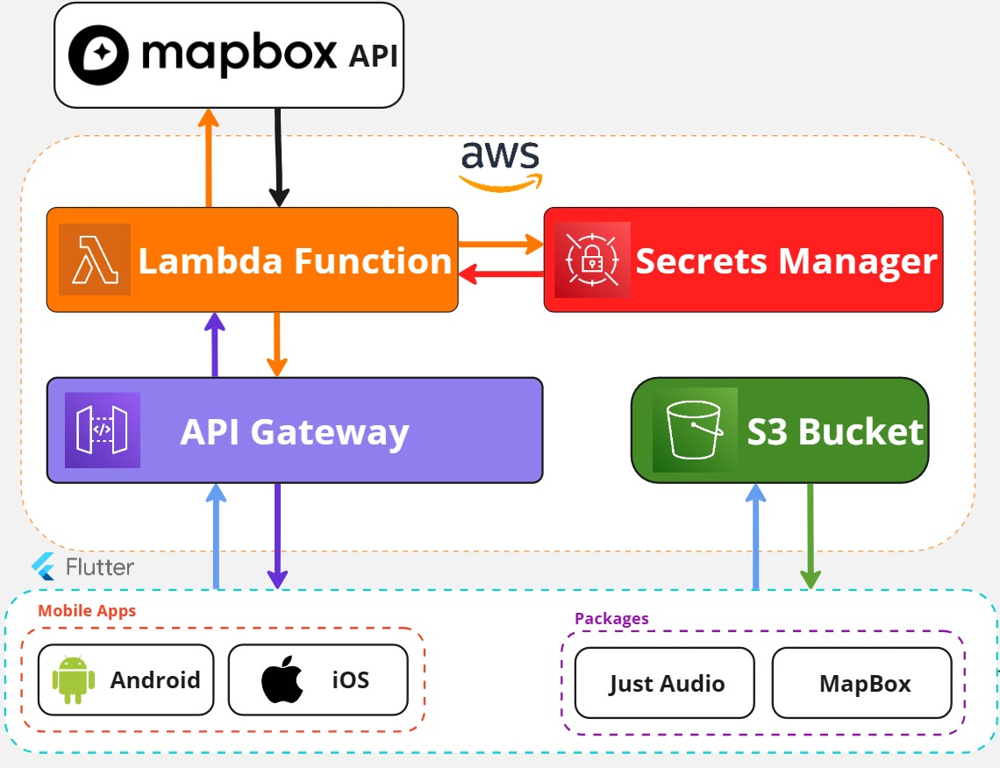

# 2024-BlackBath
[](https://flutter.dev/)
[](https://dart.dev/)
[](https://www.python.org/)
[](https://www.djangoproject.com/)
[](https://developer.android.com/studio)
[](https://developer.apple.com/xcode/)
[](https://aws.amazon.com/)
[](https://apps.apple.com/gb/app/marine-conservation-app/id6477784808)
[](https://play.google.com/store)

## Contents
- [Project Overview](#project-overview--description) 
- [Stakeholders](#stakeholders) 
- [User stories](#user-stories)
- [Key Features](#key-features)
- [Project Structure](#project-structure)
- [Architecture Diagram](#architecture-diagram)
- [User Instructions](#user-instructions)
- [Developer Instructions](#developer-instructions)
- [Team Members](#team-members)
## **Project Overview & Description**
The Black Bath project revolves around a mobile phone application for the general public to use in Bath. This app will act as a virtual walking tour in Bath, displaying sites of significance in Black History as waypoints on a map displayed within the app; each location will have associated audio files and descriptions, making the application more interactive and providing useful information about the history of the Black community in Bath.

The project aims to inform of both the well-known slave trade and its impacts, but also wishes to shine a light upon lesser known figures in the Black community who had a positive impact in Bath's history. These stories are usually overshadowed by the negative connotations commonly associated with Black history, and the purpose of this project is to make them known to the public so that they can be celebrated.

## **Stakeholders**
#### Potential Users
Will be using the app, need an enriching and fluid experience that is both informative and enjoyable. They must be able to navigate the tour around Bath
Their GPS data will be used to help navigate, this must be kept secure and their information must be protected
#### The Bath Community
Will be reflected by the app itself and the information we present in it. It is important to consider how individuals or organisations may be affected and how to best empower individuals
#### Bath Historians and Social Scientists
Will use the app as a resource, need to ensure reliable information is presented clearly and accessably. Will provide audio information for the app itself; they must be done justice in representing their information.
#### Fairfield House
Not-for-profit organisation, will provide the information to be processed by the social scientists and eventually put in to the mobile application. They will ultimately need the app to accurately portray the data and stories that they collected.
#### Conference Attendees
The app is aimed to be launched at a conference in Bath about the history of the Black community in Bath. The app will need to have the relevant information, collected by the social scientists, displayed in a user-friendly and accessible manner, in order to appeal to a wider audience.
#### The Black Community
Will be represented by past historical moments, which shall reflect on them today. As a key part of the target audience and the focus of the app, its crucial they are represented accurately and with respect as well as the app appealing to them.

## **User Stories**
* As a **member of the Black Community**, I would like to **view Black historical landmarks** to learn more about **the impact that Black people have had on Bath**, **economically and culturally**, in order to fully **appreciate** those who came here before me
* As an **African International student in Bath**, I would like to **listen to stories** about the **positive aspects of Black History** in Bath, as opposed to the **negative focus**, particularly on slavery
* As a **minority ethnic person**, I would like to **read more** about **the impact** that people in a **similar position** to me have had on Bath's **socioeconmic dynamic**, in order to fully appreciate the positive effect that different cultures can have
* As a **citizen in Bath**, I would like to **listen to longer interviews** gain a **better understanding** of **the role that Black people had** on my city's development and evolution
* As a **member of the Bath City Council**, I would like to be able to **direct members of the community** to a resource where they can **learn more about Bath's history and how the Black community contributed to it**, to help them feel more welcome and **promote racial diversity**
* As a **Social Scientist at the University of Bath**, I would like to **provide educational resources on the history of the Black community in Bath**, in a way that is **easily accessible** to most, in order to **promote racial diversity** in the city

## **Key Features**
#### Interactive Map
* Must show user's current location
* Must clearly display relevant historical sites
#### Waypoints
* 10-15 numbered waypoints for points of interest
* Must be clickable, bringing up information about the POI
#### Minimalist Design
* Sleek and modern theme for ease of use
* Usability is key
#### Audio Files
* 4-5 minute audio descriptions of historical events at each waypoint
* Option at some waypoints to play longer audio interview (~30 mins)
* Transcripts of the audio for accessibility
#### Accessible by Public
* As a stakeholder, general public need access to the app
* Must be launched on the App Store and Google Play store to reach most audiences

## **Project Structure**
> [!NOTE]
> This is a basic overview of the project structure, focusing on the general aspects of the Flutter project. A more detailed breakdown of the project structure can be found in the [Handover Document](./Docs/Handover.md).
### Root Level
```
.
├── .github                   # Workflows and templates
├── Docs                      # Client meetings and other documents
├── LICENSE                   # License used for repo 
├── README.md                 # README, contains project info
└── src/BlackBathApp          # Code files                
```
### Github Actions and Templates
Workflows (CI/CD) and templates (issue templates, pull request templates) can be found in [`.github`](./.github).
### Frontend
All frontend code can be found under [`src/BlackBathApp`](./src/BlackBathApp).
Here's some more information on each of the directories:
```
└── src
    └── BlackBathApp
        ├── .gitignore                # Contains files which shouldn't be in the repo e.g. .idea files 
        ├── .metadata                 # Project metadata
        ├── analysis_options.yaml     # Flutter linting rules
        ├── android                   # Android config files
        ├── assets                    # Images used in the app
        ├── ios                       # iOS config files
        ├── lib                       # Dart files - all app code in here
        ├── macos                     # macos config files - only needed if developing for macos, ignore
        ├── pubspec.lock              # Lock file for dependencies used in project, automatically generated/updated from pubspec.yaml when you run 'flutter pub get'
        ├── pubspec.yaml              # Yaml file that contains dependencies. You can manually edit this file to add dependencies (packages, plugins etc)
        ├── test                      # Test files for the app
        └── web                       # web config files - only needed if developing for web, ignore
```
### Backend
The backend is composed of the Mapbox API and AWS. For information on the backend, see our [Architecture Diagram](#architecture-diagram) and the [Handover Document](./Docs/Handover.md#Backend).

## **Architecture Diagram**


## **User Instructions**
### Black Bath Project User Guide
* Welcome to Black Histories in Bath, an **interactive app** to help you explore **Black History** in Bath. This project has been developed by representatives of the University of Bath in collaboration with students, with the aim of providing a rich historical context and cultural experience for all visitors to Bath.
### Visit the app
Download via the Apple Store or the Google Play Store!
> [!NOTE]
> This app is designed to run on mobile devices. Running the app on larger screens, such as iPads and Tablets, may cause unexpected formatting issues.
### Choose your guided tour route
* On the home page you can select one of the different themed routes. Each route will take you to landmarks and places associated with black history in Bath.
* **Cultural landmarks**: explore buildings and monuments associated with black culture.
* **Historical events**: learn about important black people and events in Bath's history.
* **Diverse Experiences**: Discover the rich diversity of Bath's culture.
### Interactive maps
* Each route is accompanied by an interactive map to help you navigate your way to each attraction. By clicking on the markers on the map you can view detailed historical information and pictures of the location.
### Audio Guide
* The platform provides audio tours. Clicking on the "Play" button on the page will allow you to hear a detailed explanation of the attraction. Please make sure that the volume of your device is moderately high to get the best experience.
### Cautions
* Compatible devices: Android, iOS
* Privacy and data security: We use current location services to accurately guide you through the tour. None of this data is stored.
### Contact Us
* If you have any questions or suggestions, please get in touch with us via the Contact Us page. We would love to hear your feedback and continue to improve the platform to provide a better experience.

## **Developer Instructions**
### Prerequisites
- Latest version of the [`Flutter SDK`](https://docs.flutter.dev/get-started/install)
- A suitable IDE, e.g. [Android Studio](https://developer.android.com/studio) (Recommended), [VSCode](https://code.visualstudio.com/), [Intellij IDEA](https://www.jetbrains.com/idea/) etc
- Must have a Flutter plugin/extension installed to run the Flutter framework, which is available for all suitable IDEs
- Android Emulator ([see below](#to-run-on-android)) or iOS Simulator ([see below](#to-run-on-ios))
- (Optional) Physical Android or iOS phone ([see below](#to-run-on-physical-device))

#### To run on Android
- Latest version of [`Android SDK and Build Tools`](https://developer.android.com/tools/releases/build-tools)
- Latest version of [`Java Development Kit (JDK)`](https://www.oracle.com/java/technologies/javase-jdk8-downloads.html)
- Follow [this guide](https://developer.android.com/studio/run/emulator) to run the app on an emulator
- Follow [this guide](https://developer.android.com/studio/run/device) to run the app on a physical Android device

#### To run on iOS
> [!IMPORTANT]
> This is exclusive to macOS users, as you must be able to run XCode

Follow the [guide](https://docs.flutter.dev/get-started/install/macos/mobile-ios) to install:
- XCode
- CocoaPods
- Simulator

#### Running the Flutter project
- Install all the dependencies using `flutter pub get`
- Use the command `flutter run --dart-define MAPBOX_ACCESS_TOKEN=your_access_token`
- Retrieve your token by following the instructions [below](#mapbox)

#### Cloning the Repository
Clone the repository using either:
- `git clone https://github.com/spe-uob/2024-BlackBath.git` (HTTPS)
- or `git clone git@github.com:spe-uob/2024-BlackBath.git` (SSH)

### Running Latest Version without Code
> [!IMPORTANT]
> This only works for Android, as .apk files can be easily installed and used on Android devices
#### Android
1. Navigate to Github Actions for this repository
2. Select "Continuous Delivery - Trigger on Merge..."
3. Select the most recent CD run
4. Clicking the artifact at the bottom of the page (.apk file) should begin a download of the most recent stable version
5. When complete, click the download to install the app on an Android device
6. Once installed, click the app logo to run it!

### Backend
#### Mapbox
The app displays a map and retrieves turn-by-turn directions using the Mapbox API, which requires an access token. Follow the detailed steps in the [Handover Document](./Docs/Handover.md#Mapbox) to set up a Mapbox account and retrieve tokens.
> [!WARNING]
> Make sure to monitor your token usage, specifically for the Directions API (turn-by-turn directions) and Maps SDK (displays the map).
> 
> The Directions API has a free-tier limit of 100,000 requests per month, and the Maps SDK has a free-tier limit of 25,000 users. Monitor the usage mainly of the Directions API, to detect foul play e.g. if someone is abusing the token, which can be retrieved from the app with some effort, an open issue with Mapbox tokens.
>
> If you suspect foul play, you will have to delete/disable the retrieved token, and release a new version of the app with another token.
#### AWS
The backend used for this app is serverless, so there is no need to run any sort of service before running the app, besides the initial setup.
For the initial AWS setup, see the detailed steps in the [Handover Document](./Docs/Handover.md#AWS).

## **Team Members**
| Name             |   Email ID    |
| -------------    | ------------- |
| Daniel Sekiwano  | zh23995       |
| Moksh Patel      | oc22442       |
| Penghe Huang     | va22290       |
| Yuxiao Liu       | ig22046       |
